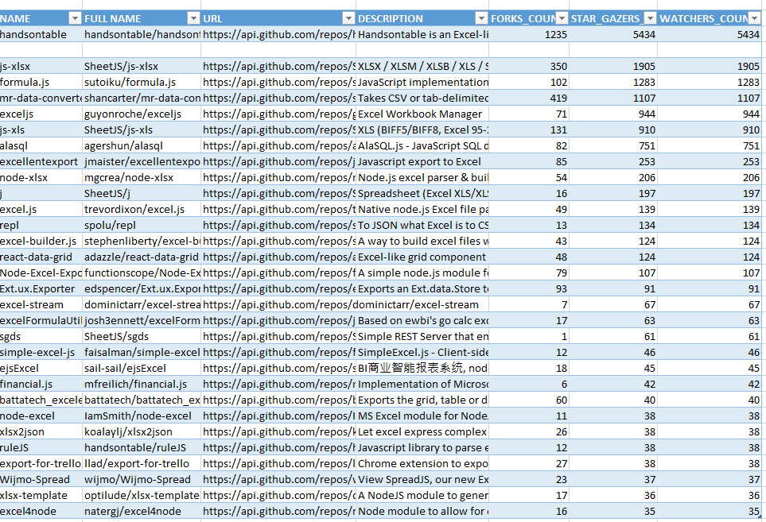
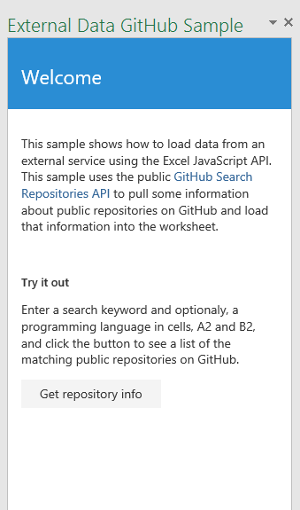

# Excel 2016 的來自 GitHub 的外部資料工作窗格增益集範例

_適用於：Excel 2016_

這個工作窗格增益集示範如何從外部服務載入資料，例如在 Excel 2016 中使用 GitHub Search API。共有兩種型態︰程式碼編輯器和 Visual Studio。

## 進行測試
### 程式碼編輯器版本

部署及測試增益集的最簡單方式，是將檔案複製到網路共用。

1.  使用您所選擇的伺服器來從程式碼編輯器專案中裝載檔案。
2.  編輯資訊清單檔的 \<SourceLocation\> 和 \<Url\> 項目，讓它指向步驟 1 中建立的裝載位置。(例如，https://localhost/ExternalDataGitHub/Home.html)
3.  將資訊清單 (ExternalDataGitHubManifest.xml) 複製到網路共用 (例如，\\\MyShare\MyManifests)。
4.  在 Excel 中，將包含資訊清單的共用位置新增為受信任的應用程式目錄。

    a.啟動 Excel，並開啟空白的試算表。

    b.選擇 **[檔案]** 索引標籤，然後選擇 **[選項]**。

    c.選擇 **[信任中心]**，然後選擇 **[信任中心設定]** 按鈕。

    d.選擇 **[受信任的增益集目錄]**。

    e.在 **[目錄 URL]** 方塊中，輸入您在步驟 3 建立的網路共用路徑，然後選擇 **[新增目錄]**。

   f.選取 **[顯示於功能表中]** 核取方塊，然後選擇 **[確定]**。接著會顯示訊息，通知您下次啟動 Office 時就會套用您的設定。

5.  測試並執行增益集。

    a.在 Excel 2016 的 **[插入]** 索引標籤中，選擇 **[我的增益集]**。

    b.在 **[Office 增益集]** 對話方塊中，選擇 **[共用資料夾]**。

    c.選擇 **[外部資料 GitHub 範例]** > **[插入]**。增益集會在工作窗格中開啟，如此圖表所示。

   

    d.在儲存格 A2 與 B2 中，輸入搜尋關鍵字和程式設計語言，按一下 [取得儲存機制資訊] 按鈕，將結果載入至試算表中的資料表，如下所示。

      

### Visual Studio 版本
1.  將專案複製到本機資料夾，並在 Visual Studio 中開啟 Excel-Add-in-JS-ExternalDataGitHub.sln。
2.  按 F5 建置及部署範例增益集。Excel 會啟動，且增益集會在工作表右側空白部分的工作窗格中開啟，如下圖所示。

  

3.  在儲存格 A2 與 B2 中，輸入搜尋關鍵字和程式設計語言，按一下 [取得儲存機制資訊] 按鈕，將結果載入至試算表中的資料表，如下所示。

  

### 深入了解

1.  [Excel 增益集程式設計概觀](https://github.com/OfficeDev/office-js-docs/blob/master/excel/excel-add-ins-programming-overview.md)
2.  [Excel 的程式碼片段總管](http://officesnippetexplorer.azurewebsites.net/#/snippets/excel)
3.  [Excel 增益集程式碼範例](https://github.com/OfficeDev/office-js-docs/blob/master/excel/excel-add-ins-code-samples.md)
4.  [Excel 增益集 JavaScript API 參考](https://github.com/OfficeDev/office-js-docs/blob/master/excel/excel-add-ins-javascript-reference.md)
5.  [建立第一個 Excel 增益集](https://github.com/OfficeDev/office-js-docs/blob/master/excel/build-your-first-excel-add-in.md)